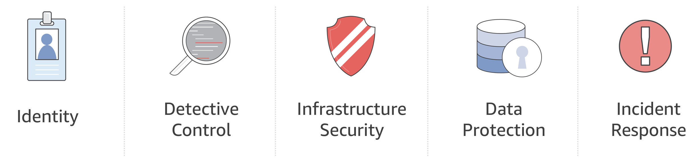

# AWS Security Workshops

Within AWS there are a variety of services that can be used to secure your environments and workloads running in the cloud. This repository contains a collection of security oriented workshops that will guide you through prepared scenarios that represent common use cases and operational tasks and give you hands on experience with a wide range of AWS services.  The workshops closely align with the [Security Perspective](https://d0.awsstatic.com/whitepapers/AWS_CAF_Security_Perspective.pdf) components of our Cloud Adoption Framework, which can be used to help you structure your selection and implementation of controls that are right for your organziation.  Captured below are the high level security components:

## Workshops

> Please review and complete all Prerequisites before attempting these workshops.

- [**Threat Detection and Remediation**](./threat-detection/) - This workshop demonstrates how you can use AWS Security services such Amazon GuardDuty and Amazon Macie to detect malicious and unauthorized threats in an environment. You'll learn how to setup detective controls in your environment, investigate a variety of findings, and put in place automated remediations using Lambda.

## Prerequisites

### AWS Account

In order to complete this workshop you'll need an AWS Account, and an AWS IAM user in that account with at Admin permissions.  The code and instructions in this workshop assume only one student is using a given AWS account at a time. If you try sharing an account with another student, you'll run into naming conflicts for certain resources. 

Use a **personal account** or create a new AWS account for this workshop rather than using an organization’s account to ensure you have full access to the necessary services and to ensure you do not leave behind any resources from the workshop.

All of the resources you will launch as part of this workshop are eligible for the AWS free tier if your account is less than 12 months old. See the [AWS Free Tier](https://aws.amazon.com/free/) page for more details.  If you are doing this workshop as part of an AWS sponsored event, you will receive credits to apply towards your account to cover any costs.

### Browser

We recommend you use the latest version of Chrome or Firefox to complete this workshop.

### Text Editor

For any workshop module that requires use of the AWS Command Line Interface (see above), you also will need a **plain text** editor for writing scripts. Any editor that inserts Windows or other special characters potentially will cause scripts to fail.

## License Summary

This sample code is made available under a modified MIT license. See the LICENSE file.
