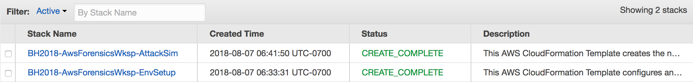

# Module 2: Attack simulation and detection

Now that you have all the detective controls setup and some automated remediations, you'll be running another CloudFormation template which will simulate a variety of findings.

### Agenda

1. Run the 2nd CloudFormation template – 5 min
2. Threat Detection & Remediation Presentation – 20 min

## Deploy the CloudFormation Template

To initiate the attack simulation you will need to run the module 2 CloudFormation template: 

Region| Deploy
------|-----
US West 2 (Oregon) | 

1. Click the **Deploy to AWS** button above.  This will automatically take you to the console to run the template.  The file for the CloudFormation template (**02-attack-simulation.yaml**) is also available in the [templates](../templates/) folder if you'd like to download it and manually upload it to create a stack.

2. The name of the stack will be automatically populated but you are free to change it, after which click **Next**, then **Next** again (leave everything on this page at the default).  

3. Finally, acknowledge that the template will create IAM roles and click **Create**

This will bring you back to the CloudFormation console. You can refresh the page to see the stack starting to create. Before moving on, make sure the stack is in a **CREATE_COMPLETE** status as shown below.

## The Big Picture

Below is a diagram of the setup after the Module 2 CloudFormation stack is created.

> If you are going through this workshop in a classroom setting then wait till the presentation is over before starting module 3 (the presentation will allow enough time to pass for the attack scenario to complete.)  
> 
> If you are going through this workshop outside of a classroom setting you can proceed to Module 3.  Please note it will take at least **20 minutes** after the 2nd CloudFormation template has completed before you will start seeing findings. 

### **[Module 3 - Forensics and Remediation](../docs/03-detection-and-remediation.md)**
