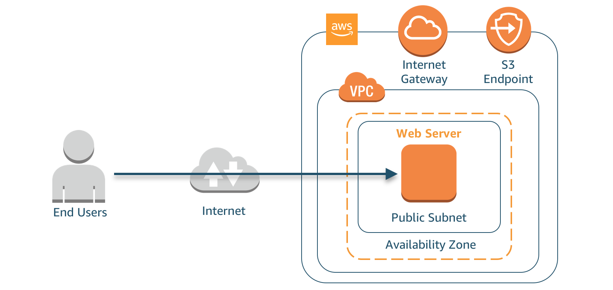

# Threat Detection and Remediation Workshop

This workshop is designed to help you get familiar with AWS Security services and learn how to use them to identify and remediate threats in your environment.  You'll be working with services such as Amazon GuardDuty, Amazon Macie, Amazon Inspector, Amazon CloudWatch, AWS Lambda, AWS Systems Manager, AWS Config, and AWS CloudTrail. You will learn how to use these services to set up a notification and remediation pipeline, investigate threats during and after an attack, and  add additional protections in place to improve the security posture of your environment.

### Pre-Requisites
You should have some level of familiarity with AWS services such as EC2, VPC and S3. Exposure to AWS Lambda and CloudFormation are a bonus. Some experience working with the AWS console is helpful as well.

### Scenario

Your company is new to the cloud and has recently performed a lift-and-shift of your infrastructure for piloting purposes.  You are a systems administrator and have been tasked with security monitoring within your AWS environment.  As part of that maintenance you are also responsible for responding to any security event in your environment.

### Architecture overview

For this Workshop you will have a single instance setup in the us-west-2 region. As this was a “lift-and-shift” migration for piloting, you have yet to build redundancy into your application, so you have a single public-facing webserver. The webserver has access to the Internet Gateway through an Elastic Network Interface. Customers access your web server through a DNS entry pointing to the Elastic Network Interface. You store static content in an S3 bucket and use the VPC S3 Endpoint Gateway for access from the webserver.

Before you migrated the application you saw a webinar about AWS security best practices. Because of that webinar, you knew to enable a number of Security services provided by AWS. 

### Region
Please use the **us-west-2 (Oregon)** region for this workshop.

### For instructors
If you would like to teach this workshop to a group of students, the instructions can be found [here.](./docs/workshop-delivery-instructions.md)

### Modules
1. [Environment Build and Configuration](./docs/01-environment-setup.md)
2. [Attack Simulation](./docs/02-attack-simulation.md) 
3. [Detection and Remediation](./docs/03-detection-and-remediation.md) 
4. [Review and Discussion](./docs/04-review-and-discussion.md)

> Total time: &plusmn; 2 hours

