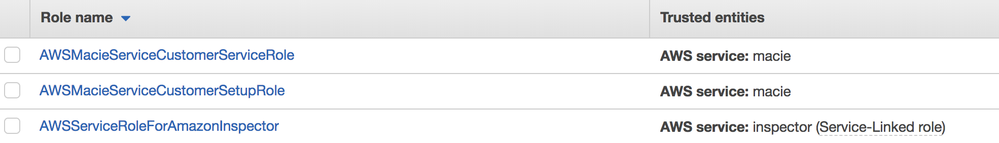
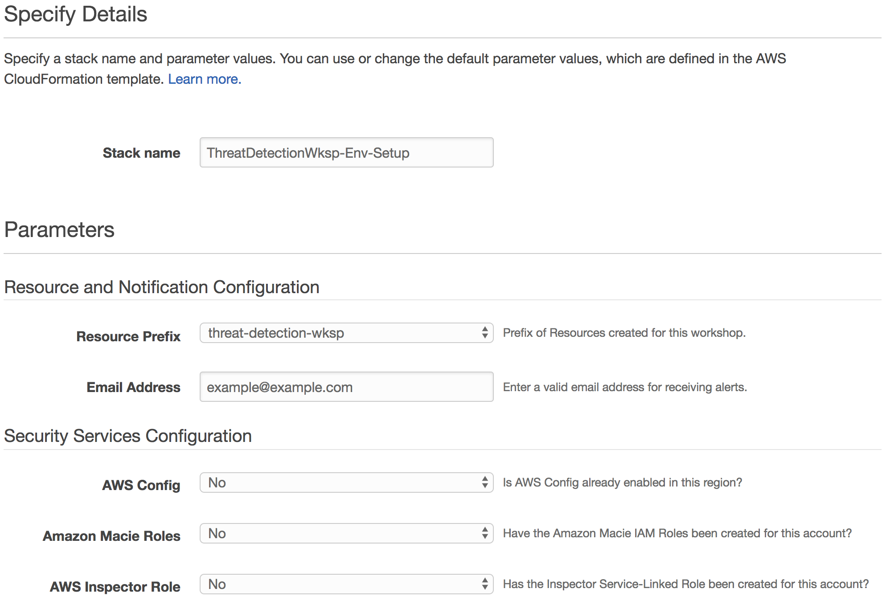

# Module 1: Environment Build and Configuration

In this module you will be configuring all the initial detective and remediation controls for your environment.  You'll be running the first of two CloudFormation templates which will automate the creation of some of these controls and then you will manaually configure the rest.

### Agenda

1.	Run the 1st CloudFormation template – 5 min
2.	Configure the remaining controls – 15 min

## Review Current Configurations

When you launch the first CloudFormation template you'll be prompted with questions regarding whether certain resources are already configured.  Please verify whether you aleady have the following configured in your account:

1.	Go to [AWS IAM](https://console.aws.amazon.com/iam/home?region=us-west-2#/roles) and see if you have the following Roles created:
	
  	
  	> If you do not see the Macie Roles; you'll answer **No** when prompted if the Macie Roles exist when launching the CloudFormation template.

  	> If you do not see the Inspector Role; you'll answer **No** when prompted if the Inspector Role exists when launching the CloudFormation template.

2.	Go to <a href="https://us-west-2.console.aws.amazon.com/config/home?region=us-west-2" target="_blank">AWS Config</a> (in the us-west-2 - Oregon region) and see if it is already enabled.
  
  	> If you see a **Get Started** button; you'll answer **No** when prompted if Config is enabled when launching the CloudFormation template.

## Deploy the CloudFormation Template

To initiate the scenario and configure your environment you will need to run the module 1 CloudFormation template: 

Region| Deploy
------|-----
US West 2 (Oregon) | [](https://console.aws.amazon.com/cloudformation/home?region=us-west-2#/stacks/new?stackName=ThreatDetectionWksp-Env-Setup&templateURL=https://s3-us-west-2.amazonaws.com/sa-security-specialist-workshops-us-west-2/01-environment-setup.yml)

1. Click the **Deploy to AWS** button above.  This will automatically take you to the console to run the template.  The file for the CloudFormation template (**01-environment-setup.yml**) is also available in the [templates](../templates/) folder if you'd like to download it and manually upload it to create a stack.

2. On the **Specify Details** section enter the necessary parameters as shown below.  Please use the answers you discovered during the *Review Current Configurations*.



3. Once you have entered your parameters click **Next**, then **Next** again \(leave everything on this page at the default\).

4. Finally, acknowledge the template will create IAM roles and click **Create**


This will bring you back to the CloudFormation console. You can refresh the page to see the stack starting to create. Before moving on, make sure the stack is in a **CREATE_COMPLETE** status as shown below.


5.	You will get an email from SNS asking you to confirm the Subscription. Confirm this so you can receive email alerts from AWS services during the Workshop.

## Setup CloudWatch Event Rules and Automatic Remediation

The CloudFormation template you just ran created three [CloudWatch Event Rules](https://docs.aws.amazon.com/AmazonCloudWatch/latest/events/WhatIsCloudWatchEvents.html) for alerting and remediation purposes. The steps below will walk you through creating the final rule.  After which you'll have all the necessary rules in place to receive email notifications and trigger the appropiate AWS Lambda functions for remediations.

Below are steps to create this rule through the console but you can also find out more about doing it programmatically by reviewing the [GuardDuty Documentation](http://docs.aws.amazon.com/guardduty/latest/ug/guardduty_findings_cloudwatch.html) for example.

1.	Open the [CloudWatch console](https://us-west-2.console.aws.amazon.com/cloudwatch/home?region=us-west-2)
2.	In the navigation pane on the left, under **Events**, choose **Rules**

	> What are the current Rules in place setup to do?
3.	Choose **Create Rule**
4.	In the dialog box, add the following is correct: 
	* Under **Event Pattern** select **Custom Event Pattern** in the drop down.
	* Paste in the custom event pattern below:
	```
	{
	  "source": [
		"aws.guardduty"
	  ],
	  "detail": {
		"type": [
		  "UnauthorizedAccess:EC2/MaliciousIPCaller.Custom "
		]
	  }
	}
	```
	* For *Targets*, click **Add Target**, select **Lambda Function**, and then select **threat-detection-wksp-remediation-nacl**.
	* Click **Configure Details**
5.	On the Configure Details screen please use insert the following information
    * Name: **threat-detection-wksp-guardduty-finding-ec2-maliciousip**
    * Description: **GuardDuty Finding: UnauthorizedAccess:EC2/MaliciousIPCaller.Custom**
    * Click **Create**.
6.	Now let’s examine the Lambda function to see what it does.  Open the [Lambda console](https://us-west-2.console.aws.amazon.com/lambda/home?region=us-west-2)
7.	Click on the function named **threat-detection-wksp-remediation-nacl**

	> What will the function do when invoked?

	> What will the other functions do?

## Enable GuardDuty

The next step is to enable Amazon GuardDuty, which will continuously monitor your environment for malicious or unauthorized behavior.

1.	Go to the [Amazon GuardDuty](https://us-west-2.console.aws.amazon.com/guardduty/home?region=us-west-2) console.

2.	Click the **Get Started** button.

3.	On the next screen click the **Enable GuardDuty** button.

GuardDuty is now enabled and continuously monitoring your CloudTrail logs, VPC flow logs, and DNS Query logs for threats in your environment.

## Enable Macie

Since you plan on storing sensitive data in S3, let’s quickly enable Amazon Macie.  Macie is a security service that will continuously monitor data access activity for anomalies and generate alerts when it detects risk of unauthorized access or inadvertent data leaks.

1.	Go to the [Amazon Macie](https://us-west-2.redirection.macie.aws.amazon.com/) console.
2.	Click **Get Started**.
3.	Check the box under **Permissions**.
	
	> The CloudFormation template you ran eariler created the IAM roles and AWS CloudTrail needed for Macie, which is why you already see the checkmarks next to those items. 

4.	Click **Enable Macie**.

## Setup Macie for Data Discovery

Macie is also used for automatically discovering and classifying sensitive data.  Now that Macie is enabled, setup an integration to classify data in your S3 bucket.

1.	In the [Amazon Macie](https://us-west-2.redirection.macie.aws.amazon.com/) console click on **Integrations** on the left navigation.

2.	Click on **Services** near the top.

3.	Select your account (should be the only one) and click **Add** (or **Details** if you already have buckets configured) for Amazon S3.

4.	Click on the paper and pencil on the far right and select the S3 bucket that ends with **“-data”**
	* Make sure you click both the checkboxes on the left and the right ends of the rows. This ensures both new and existing files get classified.
	

5.	Click **Review and Save**.

6.	Click the boxes to acknowledge pricing and terms of service and click **Save**.

Macie is now enabled and ready to classify your data and send alerts.

## Architecture Overview

Your environment is now configured and ready for operations.  Below is a diagram to dipict the detective controls you now have in place.


After you have successfully setup your environment, you can proceed to the next module.

### **[Module 2 - Attack Simulation](../docs/02-attack-simulation.md)**
