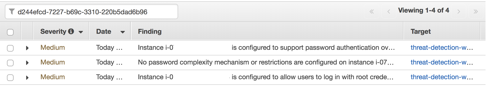
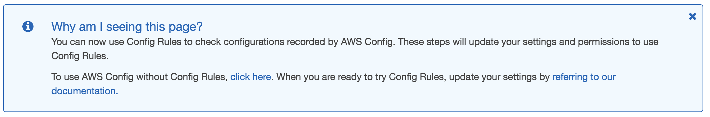
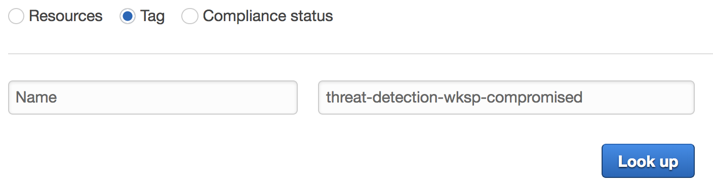

# Module 3: Detection and Remediation

Unfortunately, due to a misconfiguration in your environment, a hacker has been able to gain access to your webserver. Now, with the intruder in your environment you’re getting alerts from the security tools you’ve put in place indicating nefarious activity. These alerts include communication with known malicious IP addresses, account reconnaissance, changes to S3 policies, and disabling security configurations. You must identify exactly what activity the intruder has performed and how so you can block the intruder’s access, remediate the vulnerabilities, and restore the configuration to its proper state.

## Find Out What's Happening!

You’ve received the first alerts from GuardDuty. Now what? Assuming you’re still logged into your account, let’s see where these findings are coming from.
Since the alert came from GuardDuty, we will check there first.

### Check GuardDuty Findings

1.  Go to the [Amazon GuardDuty](https://us-west-2.console.aws.amazon.com/guardduty/home?region=us-west-2) console.
2.  In the navigation pane, click on **Findings**.  You should see all the findings below:
    

    > Don't panic if you don't see all these. The findings generated in Module 2 will take at least 20 minutes to show up in GuardDuty.
3.  The high severity  **UnauthorizedAccess:EC2/SSHBruteForce** finding is a function of our environment and can be archived with the steps below.
    * Click on the **Finding**.
    * Click on **Actions**.
    * Select **Archive**.  

      > If you're interested in seeing all of your findings (current and archived) you can click on the filter icon to the left of *Add filter criteria* to toggle them in the console.
    * After archiving you should have four findings that are associated with this workshop.
4.  Now let's examine the low severity  **UnauthorizedAccess:EC2/SSHBruteForce** finding since it was the first one to be detected.
    * Click on the **Finding**.
    * Review the finding details and affected resources.
    * Copy down the **GuardDuty Finding ID** and the **Instance ID**.

      > Was the brute force attack successful?

      > Are any of the other findings related to the brute force finding?

### Check Instance Security Assessment and Logs

Following security design best practices you already setup your servers to log to CloudWatch. You’ve also setup automated scanning of instances under attack using [AWS Inspector](https://aws.amazon.com/inspector/). Let’s look at Inspector to see if the SSH configuration adheres to best practices to determine what the risk is involved with the brute force attack.

1.  Go to [Amazon Inspector](https://us-west-2.console.aws.amazon.com/inspector/home?region=us-west-2) in the Amazon Console.
2.  Click to **Findings** in the left navigation.
3.  Review the four medium severity findings.
    
    
    If you have run multiple Inspector scans outside of this workshop you can filter down the findings by using the **GuardDuty Finding ID** (as shown above) you copied earlier.  The Inspector template that was used for the scan includes this ID in the name.

    > Which Inspector [rule packages](https://docs.aws.amazon.com/inspector/latest/userguide/inspector_rule-packages.html) were used for this scan?

    > What is CVE-2017-5754?

Based on the findings you see that password authentication is configured on the instance with no password complexity restrictions which means the instance is more susceptible to a SSH brute force attack. Let’s look at the CloudWatch logs and create a metric to see if there are any successful attempts.

4.  Go to [CloudWatch logs](https://us-west-2.console.aws.amazon.com/cloudwatch/home?region=us-west-2#logs:).
5.  Click on the log group **/threat-detection-wksp/var/log/secure**
6.  If you have multiple log streams, filter using the Instance ID you copied earlier and click on the stream.
7.  Within the **Filter Events** textbox put the following Filter Pattern: 

    ```
    [Mon, day, timestamp, ip, id, msg1= Invalid, msg2 = user, ...]
    ```

    > Do you see any failed attempts to log into the instance?
8.  Now replace the Filter with one for successful attempts:

    ```
    [Mon, day, timestamp, ip, id, msg1= Accepted, msg2 = password, ...]
    ```

    > Do you see any successful attempts to log into the instance?

    You should see a match which indicates that the SSH Brute Force attack was successful.


### Check the Remaining GuardDuty Findings

Now that you have verified that your instance was compromised, go back to the [Amazon GuardDuty](https://us-west-2.console.aws.amazon.com/guardduty/home?region=us-west-2) console and view the other findings.

> Does it look like we are early in the attack (just intrusion), or has the intruder started performing malicious actions?

View the following GuardDuty findings and take a note of the resources involved:
* **Recon:IAMUser/MaliciousIPCaller.Custom**
* **UnauthorizedAccess:IAMUser/MaliciousIPCaller.Custom**
* **UnauthorizedAccess:EC2/MaliciousIPCaller.Custom**

You can see by these findings that an advisory is using the AWS IAM Role credentials associated with the compromised instance and the instance is also communicating with an IP on your custom threat list.

### Check if Sensitive Data was Involved

At this point we know how the attacker was able to get into your systems and a general idea of what they did. After reviewing the permissions associated with the IAM Role you realize that it has very permissive policies as it relates to your S3 bucket.  Lets verify what sort of senstive data is in your bucket and take a closer at your Macie Alerts.

1.  Go to the [Amazon Macie](https://mt.us-west-2.macie.aws.amazon.com/) console.
2.  Look through the latest alerts.

    > Do you see any critical alerts?  

    Next lets verify what sort of sensitve data exists in that bucket.

3.  Click **Dashboard** in the left navigation.  You should see the following data classifications:
    

    > You can slide the risk slider to filter data classifications based on risk levels.

4.  Above the risk slider, click the **S3 Public Objects and Buckets** icon.
5.  Click the magnifying glass for the bucket listed.
6.  Verify that all the data is encrypted.

    > Look for the **Object Encryption** field.

At this point you have identified that there is a bucket with high risk data that has open public read permissions and that certain objects in your bucket are not encrypted.  When you first configured the environment you enabled default encryption for the bucket so this could be an indicator that some one has disabled it. 

Since you are already in the Macie service, create a new Basic Alert that will alert you in the future if default encryption is disabled on any of your buckets. 

7.  Click on **Settings** in the left navigation and then **Basic Alerts**.
8.  Click on **Add New**
9.  Create an alert with the following parameters:
    * **Alert title**: *Encryption Removed*
    * **Description**: *Evidence of encryption being removed from a bucket*
    * **Category**: *Data Compliance*
    * **Query**: *eventNameErrorCode.key::DeleteBucketEncryption*
    * **Index**: *CloudTrail Data*
    * **Severity**: *Critical*
    
    You can leave the other options at the default settings
10.  Click **Save**
11. In the list of alerts find the alert you just created and click on the magnifying glass to the right of the screen to run the alert. 
12. Review the alert details.

Next you need to track down if someone recently disabled default encryption and who did it.

13. Go to the [AWS CloudTrail](https://us-west-2.console.aws.amazon.com/cloudtrail/home?region=us-west-2) console
14. Click **Event History** in the left navigation.
15. Filter based on **Event Name and **DeleteBucketEncryption**.
16. Expand the latest event and click on **View Event** to see the details of the API call.

    > Who was the user who disabled default encryption on the bucket?

    > Is this the same user seen in your GuardDuty findings?

## Stop and Evaluate

So at this point we have identified a successful intrusion into our network and specific actions taken against our account. Let’s recap what those are:

* A SSH brute force Attack against an internet accessible EC2 instance was successful.
* Malware was put on the EC2 instance and communicated with a known malicious IP address.
* The IAM credentials for the server were stolen, published to S3, and used to perform reconnaissance against the account.
* An S3 bucket was made public and encryption was removed - most likely for data exfiltration.

Now that we’ve identified the attacker’s actions we need to stop them from performing any additional activities, restore our systems to their previous configurations, and protect our resources so this can’t happen again. For each of the following, develop a remediation plan for using AWS native policies and a DevSecOps approach to alerting and remediation for future attacks.

What remediations should you put in place:

1.  EC2 Brute Force attack
2.	Malware Infection
3.  EC2 Credential Theft
4.  S3 Bucket Policy

> If this is not an AWS sponsored event you can think about what remediations you would put in place and move on to the next section.

## Respond and Remediate

Before we get ahead of ourselves, we must stop any further actions from taking place. This requires removing the foothold in our environment, revoking any active credentials or removing those credentials capabilities, and blocking further actions by the attacker. 

### Verify your Automated Remediation

Based upon your existing work, you’ve implemented the first step by using the CloudWatch Event rule to trigger the Lambda function to update the NACL for the instance. Let’s look at what changed.

1.  Go to the [AWS Config](https://us-west-2.console.aws.amazon.com/config/home?region=us-west-2) console.
2.  On the Settings page you will see the message below.
    

    Click the **Click Here** button to proceed with using Config without Config Rules

3.  Click **Resources** in the left navigation.
4.  Select **Tag** and enter **Name** and **threat-detection-wksp-compromised** for the key pair like shown below:
    
6. Click on the Config timeline for the EC2 NetworkAcl.
7. Click on **Change**.
8. Evaluate the change to the updated NACL.

### Modify Security Group

Now we’ve stopped the active session from the attacker. Next, we will stop the attacker, or anyone else, from coming from a different IP. 

1.  Go to the [Amazon EC2](https://us-west-2.console.aws.amazon.com/ec2/v2/home?region=us-west-2) Console.
2.  Find the running instances with the name **threat-detection-wksp: Compromised Instance**.
    
    > You can also filter by the Instance ID you captured earlier.

3.  Under the **Description** tab, click on the Security Group for the compromised instance.
4.  View the rules under the **Inbound** tab.
5.  Click **Edit** and delete the inbound SSH rule. You've decided that all administration on EC2 Instances will be done through [AWS Systems Manager](https://aws.amazon.com/systems-manager/) so you no longer need this port open.

    > In your initial setup you already installed the SSM Agent on your EC2 Instance.


### Revoke the IAM Role Active Sessions

Now that the attacker can’t SSH into the compromised machine, we need to rotate the AWS IAM credentials and disable their permissions. Before we do that though, let’s revoke all accesses held by the previous credentials.

1.  Browse to the [AWS IAM](https://console.aws.amazon.com/iam/home?region=us-west-2) console
2.  Click **Roles** and the **threat-detection-wksp-compromised-ec2** (this is the role attached to the compromised instance) Role.
3.  Click on the **Revoke sessions** tab.
4.  Click on **Revoke active sessions**.
5.  Click the acknowledgement **check box** and then click **Revoke active sessions**. 

### Restart Instance to Rotate Credentials

Now that those credentials won’t work we need to rotate the existing server credentials. In order to change the IAM credentials on the server, we must Stop and Start the server. A simple reboot will not change the keys.

1.  Go back to the [Amazon EC2](https://us-west-2.console.aws.amazon.com/ec2/v2/home?region=us-west-2) console.
2.  To see the keys currently active on the instance, click on **Run Command** on the left hand navigation.
3.  Click **Run a command**.
4.  Select **AWS-RunShellScript**. The instance in your account should already be selected.
5.  In **Commands** type:

    ```
    curl http://169.254.169.254/latest/meta-data/iam/security-credentials/threat-detection-wksp-compromised-ec2
    ```

6.  Click **Run**.
7.  Back at the console click **Output** on the bottom of the screen once the Status is **Success**.
8.  Click View Output
9.  Make note of the **AccessKeyId** and **SecretAccessKey**
10. In the EC2 console **Stop** the Instance.
11. Wait for the Instance State to say **Stopped** and then **Start** the instance.
12. Repeat the Run Command steps to retrieve the credentials again.

    > Notice the keys are different.

    > If you want, try again after rebooting the server. The keys will stay the same.

Clearing the suspected malware is out of scope for now, but we will establish alerts for this later. This is a good use case for auto-scaling groups and golden-image AMI’s, but that is out of scope for this workshop. 

### Limit S3 Access

With the EC2 instance isolated and the IAM credentials revoked, we need to stop external access to the S3 bucket next. Before we restore the previous configuration, we can quickly make the bucket only accessible from inside the VPC. Then we can re-enable encryption.

1.  First, check the configuration of the S3 Endpoint in your environment by going to [Amazon VPC](https://us-west-2.console.aws.amazon.com/vpc/home?region=us-west-2) and clicking on **Endpoints** on the left hand navigation.
    * Copy the **Endpoint ID**
2.  Check the **Policy** on the bottom tab to notice all access is allowed.
3.  Check the Route Tables to see who is using the Endpoint.
    
    > Notice that routing to S3 is through the VPC endpoint

4.  Go to the [Amazon S3](https://s3.console.aws.amazon.com/s3/home?region=us-west-2) console.
5. Click the bucket that starts with **threat-detection-wksp-** and ends in **-data**.
6. Click on the **Permissions** tab.
7. Click **Bucket Policy**
8. Update the Bucket Policy with the following policy:

    ```
    {
      "Version": "2012-10-17",
      "Id": "Policy1415115909152",
      "Statement": [
        {
          "Sid": "Access-to-specific-VPCE-only",
          "Principal": "*",
          "Action": "s3:*",
          "Effect": "Deny",
          "Resource": ["arn:aws:s3:::<BUCKETNAME>",
                       "arn:aws:s3:::<BUCKETNAME>/*"],
          "Condition": {
            "StringNotEquals": {
              "aws:sourceVpce": "<VPCENDPOINTNAME>"
            }
          }
        }
      ]
    }
    ```

    > Be sure to replace **<BUCKETNAME>** with the name of the bucket and **<VPCENDPOINTNAME>** with endpoint ID you copied down earlier.

9.  Click **Save**. Now regardless of the bucket’s Access Control List, if traffic isn’t coming from the VPC Endpoint it will be denied. This also provides more security and better pricing for legitimate traffic.
10. To quickly restore the previous configuration for this bucket, we start by going to the [AWS Config](https://us-west-2.console.aws.amazon.com/config/home?region=us-west-2) console.
11. Under **Resources** click on **S3 Buckets**.
12. Click on your Bucket (bucket name starts with **threat-detection-wksp-** and ends in **-data**).
13. Click on **Change** under the previous configuration in the slider
    * Make note of the changes to Permissions
14. Click on **Manage Resource** in the top right. This will take you to the S3 console.
15. Click on the **Permissions** tab.
16. Remove Public Access based on Config change.
17. Click on the **Properties** Tab.
18. Re-enable S3 Default AES-256 encryption based on the Config update and Macie’s earlier alert.

With the configuration reestablished we will focus on alerts and automated remediation should the attacker try again. In Module 1 we put some of this in place. This is where the CloudWatch alerts tied to Lambda functions come into play.

After you have remediated the incident and further hardened your environment, you can proceed to the next module: **[Module 4 - Review and Discussion](../docs/04-review-and-discussion.md)**.