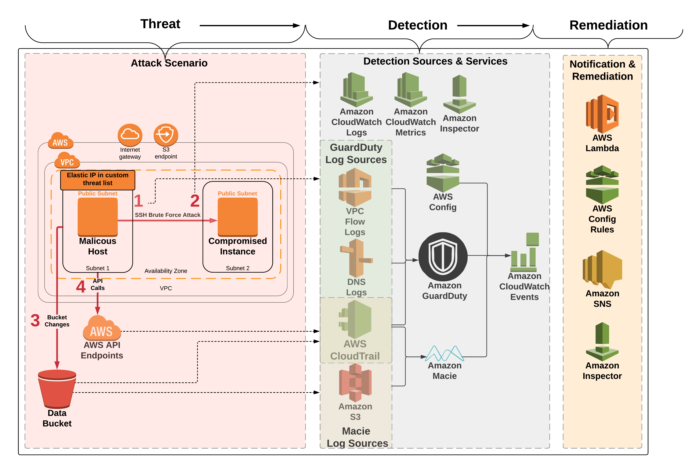

# Module 4: Review and Discussion

In the last module we will have a short discussion of the lab (and discuss exactly what occurred.) We will also go over a number of questions and then provide instructions on how to clean up the lab environment (to prevent future charges in your AWS account.) 

### Agenda

1. Review & Discussion – 10 min
2. Questions – 10 min
3. Cleanup – 5 min

## Architecture Overview
Diagram of the overall lab setup:

## What is Really Going On?

In **Module 1** of the lab you setup the initial components of your infrastructure including GuardDuty, Macie and a simple notification and remediation pipeline. Some of the steps required manual configuration but you also ran a CloudFormation template which setup some of the components. In **Module 2** you launched a second CloudFormation template that initiated the attack simulated by this lab. The CloudFormation template created two EC2 instances. One instance (named **Malicious Host**) had an EIP attached to it that was added to your GuardDuty custom threat list. Although the **Malicious Host** is in the same VPC as the other instance, for the sake of the scenario (and to prevent the need to submit a penetration testing request) we acted as if it is on the Internet and represented the attack's computer. The other instance (named **Compromised Instance**) was your web server and it was taken over by the **Malicious Host**. In **Module 3** you investigated the attack, remediated the damage, and setup some automated remediations for future attacks.  

### Here is what occurred in the attack:	

1. There are two instances created by the Module 2 CloudFormation template. They are in the same VPC but different subnets. The **Malicious Host** represents the attacker which we pretend is on the Internet. The Elastic IP on the **Malicious Host** is in a custom threat list in GuardDuty. The other instance named **Compromised Instance** represents the web server that was lifted and shifted into AWS.

2. Although company policy is that only key-based authentication should be enabled for SSH, at some point password authentication for SSH was enabled on the **Compromised Instance**.  
	
	> This misconfiguration is identified in the Inspector scan that is triggered from the GuardDuty finding.

3. The **Malicious Host** performed a brute force SSH password attack against the **Compromised Instance**. The brute force attack is designed to be successful.
	
	> **GuardDuty Finding**: UnauthorizedAccess:EC2/SSHBruteForce

4. The SSH brute force attack was successful and the attacker was able to log in to the **Compromised Instance**.
	
	> Successful login is confirmed in CloudWatch Logs (/threat-detection-wksp/var/log/secure).

5. The EC2 Instance that is created in the Module 2 CloudFormation template disabled default encryption on the **Data** bucket.  In addition the CloudFormation template made the **Data** bucket public.  This is used for the Macie part of the investigation in Module 3. We pretend that the attacker made the bucket public and removed the default encryption from the bucket.
	
	> **Macie Alert**: S3 Bucket IAM policy grants global read rights

6.  The Compromised Instance also has a cron job that continuously pings the Malicious Host to generate a GuardDuty finding based off the custom threat list.
	
	> **GuardDuty Finding**: UnauthorizedAccess:EC2/MaliciousIPCaller.Custom

7. The API Calls that generated the API findings come from the **Malicious Host**. The calls use the temp creds from the IAM role for EC2 running on the **Malicious Host**. The GuardDuty findings are generated because the EIP attached to the **Malicious Host** is in a custom threat list. 
	
	> **GuardDuty Findings**: 
		* Recon:IAMUser/MaliciousIPCaller.Custom
		* UnauthorizedAccess:IAMUser/MaliciousIPCaller.Custom

8. A number of CloudWatch Events Rules are evoked by the GuardDuty findings and then these trigger various services.
	1.	**CloudWatch Event Rule**: The generic GuardDuty finding invokes a CloudWatch Event rule which triggers SNS to send an email.
	2.	**CloudWatch Event Rule**: The generic Macie alert invokes a CloudWatch Event rule which triggers SNS to send an email.
	3.	**CloudWatch Event Rule**: The SSH brute force attack finding invokes a CloudWatch Event rule which triggers a Lambda function to block the attacker IP address of the attacker via a NACL as well as a Lambda function that runs an Inspector scan on the EC2 instance.
	4. **CloudWatch Event Rule**: The Unauthorized Access Custom MaliciousIP finding invokes a CloudWatch Event rule which triggers a Lambda function to block the IP address of the attacker via a NACL.

## Cleanup
In order to prevent charges to your account we recommend cleaning up the infrastructure that was created. If you plan to keep things running so you can examine the lab a bit more please remember to do the cleanup when you are done. It is very easy to leave things running in an AWS account, forgot about it, and then accrue charges. 

> You will need to manually delete some resources before you delete the CloudFormation stacks so please do the following steps in order.

1.	Delete the IAM Role for the compromised EC2 instance and the Service-Linked Role for Inspector (if you didn't already have this Role created).
	* Go to [AWS IAM](https://console.aws.amazon.com/iam/) console.
	* Click on **Roles**
	* Search for the role named **threat-detection-wksp-compromised-ec2**.
	* Click the check box next to it and click **Delete**.
	* Repeat for the second role (**AWSServiceRoleForAmazonInspector**).

2.	Delete all three S3 buckets created by the Module 1 CloudFormation template (the buckets that start with **threat-detection-wksp** and end with **-data**, **-threatlist** and **-logs**)
	* Go to [Amazon S3](https://s3.console.aws.amazon.com/s3/home?region=us-west-2) console.
	* Click on the appropiate bucket.
	* Click **Delete Bucket**.
	* Copy and paste the name of the bucket (this is an extra verification that you actually want to delete the bucket).
	* Repeat steps for the other buckets.

3.	Delete Module 1 and 2 CloudFormation stacks (**ThreatDetectionWksp-Env-Setup** and **ThreatDetectionWksp-Attacks**).
	* Go to the [AWS CloudFormation](https://us-west-2.console.aws.amazon.com/cloudformation/home?region=us-west-2#/stacks?filter=active) console.
	* Select the appropiate stack.
	* Select **Action**.
	* Click **Delete Stack**.
	* Repeat for the other buckets second stack.

	> You do not need to wait for the first stack to delete before you delete the second one.

4.	Delete the GuardDuty custom threat list and disable GuardDuty (if you didn't already have it configured before the workshop)
	* Go to the [Amazon GuardDuty](https://us-west-2.console.aws.amazon.com/guardduty/) console.
	* Click on **Lists** in the navigation pane on the left.
	* Click the **X** next to the threat list that starts with **Custom-Threat-List**.
	* Click **Settings** in the navigation pane on the left.
	* Click the check box next to **Disable**.
	* Click **Save Settings**

5.	Delete the manual CloudWatch Event Rule you created and the CloudWatch Logs that were generated.
	* Go to the [AWS CloudWatch](https://us-west-2.console.aws.amazon.com/cloudwatch) console.
	* Click on **Rules** in the navigation pane on the left.
	* Click the radio button next **threat-detection-wksp-guardduty-finding-maliciousip**.
	* Select **Action** and click **Delete**.
	* Click on **Logs** in the naviagation pane on the left.
	* Click the radio button next to **/aws/lambda/threat-detection-wksp-inspector-role-creation**.
	* Select **Action** and click **Delete Log Group**.
	* Repeat for: 
		* **/aws/lambda/threat-detection-wksp-remediation-inspector**
		* **/aws/lambda/threat-detection-wksp-remediation-nacl**
		* **/threat-detection-wksp/var/log/secure** 
		* **/threat-detection-wksp/vpc-ID#/flowlogs**

6.	Delete the Inspector objects created for the workshop.
	* Go to the [Amazon Inspector](https://us-west-2.console.aws.amazon.com/inspector) console.
	* Click on **Assessment Targets** in the navigation pane on the left.
	* Delete all that start with **threat-detection-wksp**.

7.	Delete the SNS subscription that was created when you subscribed to SNS Topic.
	* Go to the [AWS SNS](https://us-west-2.console.aws.amazon.com/sns) console.
	* Click on **Subscriptions**
	* Select the check box next to the subscription that shows your e-mail as the Endpoint and has **threat-detection-wksp** in the **Subscription ARN**.
	* Select **Action** and then click **Delete subscriptions**

8.	Disable Macie (if you didn't already have Macie enabled before the Workshop).
	* Go the [Amazon Macie]((https://mt.us-west-2.macie.aws.amazon.com/) console.
	* In the upper hand corner select the down arrow to the left of the Region and select **Macie General Settings**.
	* Check the two boxes and click **Disable Amazon Macie**

## Finished!

Congratulations on completing this workshop! This is the workshop's permanent home, so feel free to revisit as often as you'd like.

