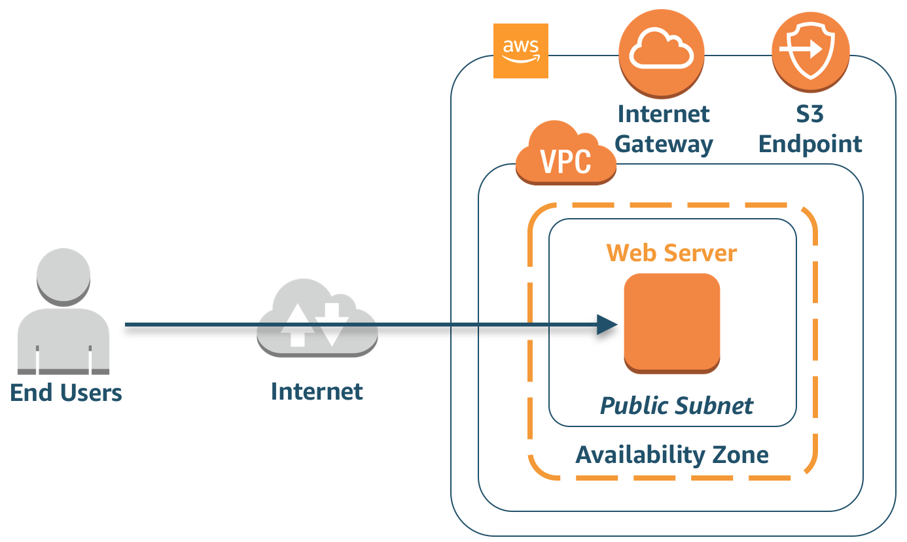

# Threat Detection Workshop

This workshop is designed to get attendees familiar and comfortable with how AWS Security services can identify threats and demonstrate how to remediate findings.

We will cover the following services: Amazon GuardDuty, Amazon Macie, Amazon Inspector, Amazon CloudWatch (Events & Logs), AWS Lambda, Amazon SNS, Amazon S3, VPC Flow Logs, DNS Logs and AWS CloudTrail. You will learn how to use these services to set up a notification and remediation pipeline, to investigate threats during and after an attack, and to evaluate what additional alerts and automated remediations should be deployed.

We will go through a simulated attack scenario that will generate real GuardDuty findings and Macie alerts. We will investigate the attack, examine the threats, remediate the attack and investigate additional automated remediations that can be used in the future.

### Scenario
You are a systems administrator for a web services company. New to the cloud, you have performed a lift-and-shift of your infrastructure for piloting purposes leaving multiple instances available to the internet. However, the security best practices haven’t been evaluated yet. As the administrator of the system, you have been tasked with responding to any security alerts generated from your instances both during office hours and while on call.

### Architecture
For this Workshop you will have a single instance setup in the us-west-2 region. As this was a “lift-and-shift” migration for piloting you have yet to build redundancy into your application, so you have a single public-facing webserver. The webserver has access to the Internet Gateway through an Elastic Network Interface. Customers access your web server through a DNS entry pointing to the Elastic Network Interface. You store static content in an S3 bucket and use the VPC S3 Endpoint Gateway for access from the webserver.

Before you migrated the application you saw a webinar about AWS security best practices. Because of that webinar, you knew to enable the following security products: VPC Flow Logs, Config, CloudTrail, and GuardDuty.

### Region
Please use the **us-west-2 (Oregon)** region for this workshop.

### Modules
* [1. Environment Build and Configuration](./docs/01-environment-setup.md)
* [2. Generate Findings](./docs/02-generate-findings.md) 
* [3. Detection and Remediation](./docs/03-investigate-remediation.md) 
* [4. Review and Discussion](./docs/04-review-and-dicussion.md)

