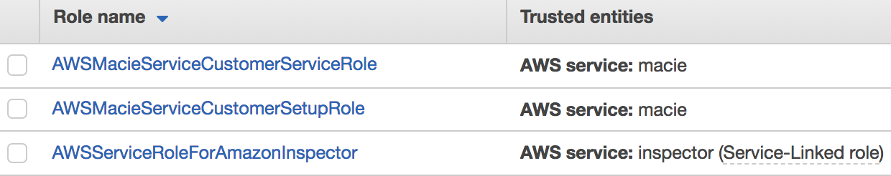
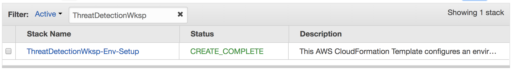

# Module 1: Environment Build and Configuration

In this module you will be configuring all the initial detective and remediation controls for your environment.  You'll be running the first of two CloudFormation templates which will automate the creation of some of these controls and then you will manaually configure the rest. Below is a visual representation of what you'll be configuring in your environment.

## Review Current Configurations

Before you the run the template please verify whether you already have the following services or resources configured.  When you launch the first CloudFormation template you'll be prompted with questions regarding whether these resources are already configured.

1. Go to AWS IAM and see if you have the following Roles created:

  > If you do not see the Macie Roles; you'll answer **No** when prompted if the Macie Roles exist when launching the CloudFormation template.

  > If you do not see the Inspector Role; you'll answer **No** when prompted if the Inspector Role exists when launching the CloudFormation template.

2. Go to <a href="https://us-west-2.console.aws.amazon.com/config/home?region=us-west-2" target="_blank">AWS Config</a> (in the us-west-2 region) and see if it is already enabled.
  > If you see a **Get Started** button; you'll answer **No** when prompted if Config is enabled when launching the CloudFormation template.

## Deploy the CloudFormation Template

To initiate the scenario and configure your environment you will need to run the module 1 CloudFormation template: 

Region| Launch
------|-----
US West 2 (Oregon) | [](https://console.aws.amazon.com/cloudformation/home?region=us-west-2#/stacks/new?stackName=ThreatDetectionWksp-Setup&templateURL=https://s3-us-west-2.amazonaws.com/sa-security-specialist-workshops-us-west-2/01-environment-setup.yml)

### Launch Instructions

1. Click the **Launch Stack** button above.  This will automatically take you to the console to run the template.  The file for the CloudFormation template (**01-environment-setup.yml**) is also available in the [templates](../templates/) folder if you'd like to download it and manually upload it to create a stack.

2. On the **Specify Details** section enter the necessary parameters as shown below.  Please use the answers you discovered during the *Review Current Configurations*.


3. Once you have entered your parameters click **Next**, then **Next** again \(leave everything on this page at the default\).

4. Finally acknowledge the template will create IAM roles and click **Create**


This will bring you back to the CloudFormation console. You can refresh the page to see the stack starting to create. Before moving on, make sure the stack is in a **CREATE_COMPLETE** status as shown below.



5.	You will get an email from SNS asking you to confirm the Subscription. Confirm this so you can receive email alerts from AWS services during the Workshop.

## Setup CloudWatch Event Rules and Automatic Remediation

Before configuring some of the Security services, we want to make sure we get alerting. We will use this alerting to kick off auto-remediation of well-documented issues. The CloudFormation template you just ran created three [CloudWatch Event Rules](https://docs.aws.amazon.com/AmazonCloudWatch/latest/events/WhatIsCloudWatchEvents.html) and the steps below will walk you through creating the final rule in order to trigger your remediation Lambda functions whenever GuardDuty or Macie flag any findings. 

Below are steps to create this rule through the console but you can also find out more about doing it programmatically by reviewing the [GuardDuty Documentation](http://docs.aws.amazon.com/guardduty/latest/ug/guardduty_findings_cloudwatch.html) for example. You can also look at the other rules to see how the AWS Simple Notification Service (SNS) is used for subscribing emails to alerts.

1.	Open the [CloudWatch console](https://us-west-2.console.aws.amazon.com/cloudwatch/home?region=us-west-2)
2.	In the navigation pane on the left, under **Events**, choose **Rules**
3.	Choose **Create Rule**
4.	In the dialog box, add the following is correct: 
	* For *Event Source*, choose **Event Pattern** and set **Service Name** to **GuardDuty**
	* Edit the **Event Pattern Preview** to contain a specific finding using the following text
	```
	{
	  "source": [
		"aws.guardduty"
	  ],
	  "detail": {
		"type": [
		  "UnauthorizedAccess:EC2/MaliciousIPCaller.Custom "
		]
	  }
	}
	```
	* For *Targets*, click **Add Target**, select **Lambda Function**, and then select **threat-detection-wksp-remediation-NACL**.
	* Click **Configure Details**
5.	On the Configure Details screen please use insert the following information
    * Name: **threat-detection-wksp-guardduty-finding-ec2-maliciousip**
    * Description: **GuardDuty Finding: UnauthorizedAccess:EC2/MaliciousIPCaller.Custom**
    * Click **Create**.
6.	Now let’s examine the Lambda function to see what it does.  Open the [Lambda console](https://us-west-2.console.aws.amazon.com/lambda/home?region=us-west-2)
7.	Click on the function named **threat\-detection\-wksp\-remediation\-NACL**

> *What does this code snippet cause the function to do?*

### Enable GuardDuty

The next step is to enable Amazon GuardDuty. Browse to [Amazon GuardDuty](https://us-west-2.console.aws.amazon.com/guardduty/home?region=us-west-2) in the Amazon Console.

1.	Once you are in the GuardDuty console, Click the **Get Started** button.
2.	On the next screen click the **Enable GuardDuty** button.
3.	That is all that is required to enable GuardDuty. 

### Enable Macie

Since Macie isn’t turned on but you plan on storing data in S3, let’s quickly enable it.

1.	Under Services click [Amazon Macie](https://us-west-2.redirection.macie.aws.amazon.com/).
2.	Make sure the top left indicated you are in the **us-west-2 (Oregon)** region.
3.	Click **Get Started**.
4.	Check the box under **Permissions**.
5.	Click **Enable Macie**.
	*	The IAM roles created and AWS CloudTrail enabled should have checks next to them based on the template’s output.
6.	Once inside of Macie, click on **Integrations** on the left hand navigation.
7.	Click on **Services** near the top.
8.	Select your account (should be the only one) and click **Add** (or **Details** if you already have buckets configured) for Amazon S3.
9.	Click on the paper and pencil on the far right and select the S3 bucket that ends with **“-data”**
	* Make sure you click both the checkboxes on the left and the right ends of the rows. This ensures both new and existing files get classified.


### Enable Macie

Since Macie isn’t turned on but you plan on storing data in S3, let’s quickly enable it.

1.	Once you are in the GuardDuty console, Click the **Get Started** button.
2.	On the next screen click the **Enable GuardDuty** button.

1.	Under Services click [Amazon Macie](https://us-west-2.redirection.macie.aws.amazon.com/).
2.	Make sure the top left indicated you are in the **us-west-2 (Oregon)** region.
3.	Click **Get Started**.
4.	Check the box under **Permissions**.
5.	Click **Enable Macie**.
	* The IAM roles created and AWS CloudTrail enabled should have checks next to them based on the template’s output
	* Wait for a minute while Macie starts up
6.	Once inside of Macie, click on **Integrations** on the left hand navigation
7.	Click on **Services** near the top
8.	Select your account (should be the only one) and click **Add** (or **Details** if you already have buckets configured) for Amazon S3
9.	Click on the paper and pencil on the far right and select the S3 bucket that ends with **“-data”**
	* **Make sure you click both the checkboxes on the left and the right ends of the rows. This ensures both new and existing files get classified.**

	

10.	Click **Review and Save**
11.	Click the boxes to acknowledge pricing and terms of service and click **Save**

Macie is now enabled and ready to classify your data and send alerts and our environment is configured and ready for operations.  Below is diagram to dipict the detective controls you now in place.


## Troubleshooting

### Create the Service\-linked role for Inspector \(IF NECESSARY\)

We will use Inspector to evaluate instances that may be under attack. Before we can enable Inspector, we need to create a Service\-linked role. A service\-linked role is a unique type of IAM role that is linked directly to an AWS service. Service\-linked roles are predefined by the service and include all the permissions that the service requires to call other AWS services on your behalf. To create the role, follow these steps.

1.>	Go to the [IAM console](https://console.aws.amazon.com/iam/home?region=us-west-2#/home)
2.>	Click ***Roles*** on the left navigation
3.>	Click ***Create Role***
4.>	Click ***Inspector*** in the list of AWS Services to build the role for
5.>	Click ***Next:Permissions***
6.>	Click ***Next:Review***
7.>	Click ***Create Role***

If you already have a role for Inspector you will see the following error:

 
### Macie CloudTrail Log Error

If you previous configured Macie but didn’t delete the CloudTrail log, you will receive the following error:


 
To fix this, perform the following steps:

1.>	Go to the [CloudTrail console](https://us-west-2.console.aws.amazon.com/cloudtrail/home?region=us-west-2)
2.>	Click on ***Trails***
3.>	Click on the trail named ***AWSMacieTrail\DO\_NOT\_EDIT***
4.>	Click on the trash can under the logging on/off toggle on the right.
5.>	Click ***Delete***
6.>	Go back to the [Macie console](https://us-west-2.redirection.macie.aws.amazon.com/) and select your account again.

